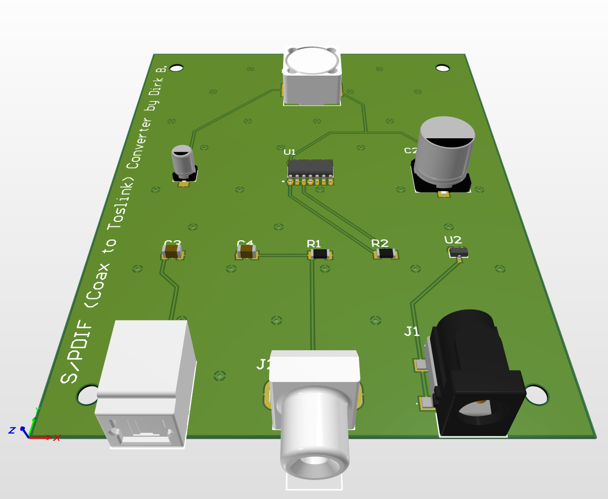
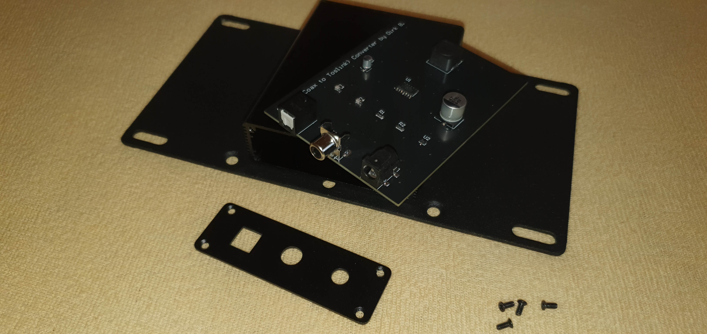
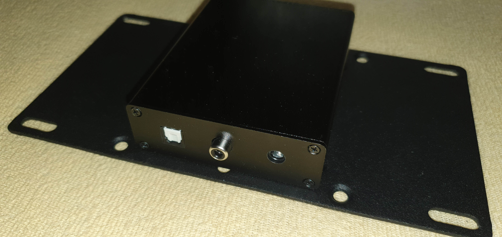
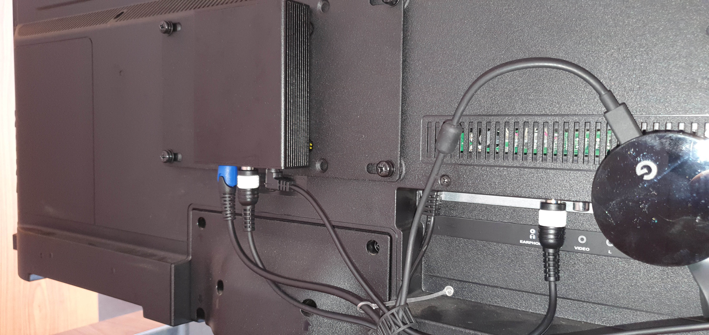

# S/PDIF Converter (Coax -> TOSLINK)
This is a very simple S/PDIF electrical to optical signal converter. It is designed to be powered via USB port or via USB power supply. With a power consumption of around 25mA even the USB 2.0 port of an old flat-screen TV is sufficient.

## Description
The PCB has a fairly simple design:

It uses a 74HCU04D hex unbuffered inverter to bring the signal amplitude of -0.5V to +0.5V from the coax input to TTL level (0V to +5V), powering the fiber optical transmitter, which then outputs the signal as light pulses.
Since the transmitter and the inverter don't like voltages above 5V i would highly recommend always using a regulated power supply, if no USB port is available for power delivery.

The PCB is designed for larger SMD components - so even soldering beginners shouldn't have any problems with it. I've included a [bill of materials](BOM.xlsx) with links to every part. The PCB has some M3 mounting holes, if someone wants to mount it inside a case... but aside from that, it fits perfectly inside a 82 x 27 x 100mm aluminum housing like [this one](https://aliexpress.com/item/32982948345.html):

## Usage
It's just plug'n'play. I've mounted it on the back of my TV (since this one only provides digital audio output via coax connector):

... connected it with the USB port of my TV and then with my soundbar. It worked right out of the box!
